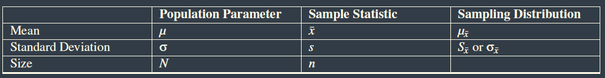

# Foundations of Data Analysis - Part 1 & 2: Statistics Using R

Comment: Texas Univ - Parts 1 & 2
Achieved content: 12
Total content: 12
Done ?: 1
Fields: Data science, R, Stats
Link 1: https://courses.edx.org/courses/course-v1:UTAustinX+UT.7.11x+2T2017/course/
Link 2: https://courses.edx.org/courses/course-v1:UTAustinX+UT.7.21x+2T2017/course/
Percent: 100
Progress: ■■■■■■■■■■ 100%
Rate: ⭐⭐⭐⭐⭐
Type: edX

# PART 1

# Introduction to Data

## Variables and Levels of Measurements

- **Readings**

    [Files MD/Chapter_01.pdf](Files MD/Chapter_01.pdf)

    Required lecture

    [Files MD/Week_1_-_Optional.pdf](Files MD/Week_1_-_Optional.pdf)

    Optional lecture

- **Difference between $\mu$, $\bar{x}$, $p$ and $\hat{p}$**

    Two statistics we will study are the mean *(also called the average outside statistics)* and proportion.

    - **Population** : mean = $\mu$ and proportion = $p$ ; All are **parameters**
    - **Sample** : mean = $\bar{x}$ and proportion = $\hat{p}$ ; All are **statistics**

    In general, statisticians say that $\bar{x}$, the mean of a portion of the population is an estimate of $\mu$, the mean of the population, which is usually unknown.

    

---

## LAB

- ***Pre-Lab : Cycling in Austin***

    ### Reflect on the Question

    - **Statement**

        In 2011, researchers at the Texas Transportation Institute and the Center for Transportation Research at UT Austin ran an advertising campaign aimed at recruiting Austin cyclists to join the South Congress Bike Mapping Project. As members of the project, cyclists downloaded and used Cycle Tracks, a smartphone app developed by the San Francisco County Transportation Authority to track where people are riding their bikes based on their GPS points. The goal was to gain new information about bike commuting patterns and this data set is based on the results of the study: 3600 trips tracked from 315 users over a 6 month period. Data includes distances traveled, speed of travel, and reasons for travel among other variables.

    **Primary Research Question** : How many of the cyclists were students, how often did they ride, and what was the average distance they rode?

    - `Code` for preliminary questions

        ```r
        bike = BikeData
        table(bike$student) #how much students ?

        table(bike$cyc_freq[seq(1, 10, by=1)]) #how much of the 10 first riders ride daily ?

        female_riders = bike[bike$gender == 'F',]
        female_riders[female_riders$cyc_freq == 'Less than once a month',] #the speed of the first female who cycles less than one time per month (in miles/hour)?
        ```

    ### Analyze the Data

    - **Steps**
        1. Find the number of students in the dataset.
        2. Pull out the student data into a separate dataframe for analysis.
        3. Make a table to find how often the students ride.
        4. Find the average distance ridden.
    - `Code`

        ```r
        # Import the BikeData dataset, name it "bike"

        # Find the number of students in the dataset
        table(bike$student)

        # Pull out student data into a new dataframe
        student <-bike[bike$student==1,]

        # Find how often the students ride, using the new dataframe
        table(student$cyc_freq)

        # Create a vector for the distance variable
        distance <-student$distance

        # Find average distance ridden
        mean(distance)
        ```

    ### Draw Conclusions

    In this Pre Lab, we examined data 14 student riders. Most of the student riders ( a total of 8 out of 14) rode their bikes daily. On average, the students rode about 6.26 miles on each trip.

- ***Lab : Cycling in Austin***

    ### Reflect on the Question

    - **Statement**

        In 2011, researchers at the Texas Transportation Institute and the Center for Transportation Research at UT Austin ran an advertising campaign aimed at recruiting Austin cyclists to join the South Congress Bike Mapping Project. As members of the project, cyclists downloaded and used Cycle Tracks, a smartphone app developed by the San Francisco County Transportation Authority to track where people are riding their bikes based on their GPS points. The goal was to gain new information about bike commuting patterns and this data set is based on the results of the study: 3600 trips tracked from 315 users over a 6 month period. Data includes distances traveled, speed of travel, and reasons for travel among other variables.

    **Primary Research Question** : How many of the cyclists rode daily, how many of these riders were male and how many female, and what what were their average ages?

    ### Analyze the Data

    - **Steps**
        1. Make a table to show how many **daily** riders are in the original dataset.
        2. Create a **new datafile** that includes only the daily riders.
        3. Make a **table** to show the number of male and female daily riders.
        4. Make a **vector** of the ages of these daily riders.
        5. Find the **mean** age for men and for women daily riders.
    - `Code`

        ```r
        table(bike$cyc_freq)

        daily <-bike[bike$cyc_freq=='Daily',]

        table(daily$gender)

        age <-daily$age
        age_male = daily$age[daily$gender=='M']
        age_female = daily$age[daily$gender=='F']

        mean(age)
        mean(age_female)
        mean(age_male)

        old_male_daily = daily[daily$gender=='M',]
        ```

    ### Draw Conclusions

    In this lab, we examined data on 47 daily riders. Most of the daily riders (a total of 38) were male. The average age of all daily riders was 33.7. The average age of female daily riders was 32.6, while the average age of male daily riders was 33.9.

---

# 🗨️ Univariate Descriptive Statistics

> Descriptive statistics can tell us what the distribution of a variable looks like

## Distributions Overview

- **Readings**

    [Files MD/Chapter_02.pdf](Files MD/Chapter_02.pdf)

    [Files MD/Chapter_03.pdf](Files MD/Chapter_03.pdf)

    [Files MD/Chapter_04.pdf](Files MD/Chapter_04.pdf)

    [Files MD/Week_2_-_Optional.pdf](Files MD/Week_2_-_Optional.pdf)

    Optional reading

### How to look at Data

- **Shapes of Distributions vocabulary**
    - **Unimodal** histograms have a single peak, and represent data with a single most common frequency.
    - **Bimodal** histograms have two prominent peaks.
    - **Multimodal** histograms have more than one ’peak’ in the data. Recall that the mode is the most common value, so a multimodal histogram represents data with multiple classes that have a frequency equal to the greatest single frequency in the data.
    - **Outliers** are uncommon frequencies occurring some distance from the peak. We will learn how to identify these in later units.
    - A **normal distribution** creates a histogram in the shape of a bell. This **bell curve** makes it clear that the majority of the data lies close to the mean.

### Describing Distributions

- **Measures of Center** *(Mode, Mean, Median)*
    - **Mode** : defined as the most frequently occurring value in a data set. The mode really only has significance for data measured at the most basic of levels. The mode is most useful in situations that involve categorical (qualitative) data that is measured at the nominal level.

        *→ If there is more than one number that is the most frequent than the mode is both of those numbers.*

    - **Mean** *[(stats)](https://www.notion.so/Foundations-of-Data-Analysis-Part-1-Statistics-Using-R-66dbf4bc816645a89b3ba822e3b20c0a#40b2056e109a496b97943fb4328a0d44)* : The mean is actually the numerical “balancing point” of the data set. A certain math teacher might refer to the mean as being "the center of mass".
    - **Median** : The median is simply the middle number in a set of data. Of course, when there is an even number of numbers, there is no true value in the middle. In this case we take the two middle numbers and find their mean.

**Mean vs. Median** : The important thing to understand is that extremely large or small values in a data set can have a large influence on the mean.

- **Shape of a Distribution and Its Relationship to Measures of Center**

    → We typically use the **median** to describe the center of a skewed distribution. *You know how to recognize the mode, or the score with the highest frequency.* The **mean** of a skewed distribution will always be pulled toward the tail of the distribution. And, as shown on the histograms below, the **median** always falls between the **mean** and the **mode** of a skewed distribution.

    

**Resistance** : A statistic that is not affected by outliers is called resistant. We say that the median is a resistant measure of center, and the mean is not resistant.

- **Stem-and-leaf plot**

    

    Plot number of characters from email50 data set

    

    Same plot but splitted

- **Dot plot**

    

    A dot plot of num_char for the email50 data set

- **Quartiles and Percentiles**
    - A **quartile** divides the data into four approximately equal groups.
    - A **percentile** is a statistic that identifies the percentage of the data that is less than the given value.

    → The lower quartile, sometimes abbreviated as **Q1**, is also know as the **25th** percentile. Technically, the median is a“middle” quartile and is referred to as **Q2**. Because it is the numeric middle of the data, half of the data is below the median and half is above. The upper quartile, or **Q3**, is also know as the **75th** percentile.

**Range** : The range is a statistic, and as such is a single number.

**Interquartile range** *(IQR)* : $IQR = Q3 - Q1$ (see IQR as a lower range nearest the middle 50% of the data)

**Five-Number Summary** : The five-number summary is a numerical description of a data set comprised of the following measures (in order):
minimum value, lower quartile, median, upper quartile, maximum value.

**Outlier** : This rather arbitrary definition is that any point that is more than **1.5 times the IQR** outside the box will be considered an outlier. *Because the IQR is the same as the length of the box, any point that is more than one-and-a-half box lengths below Q1 or above Q3 is plotted as a separate point and not included in the whisker.*

### A Look at Normal Distributions

- **Standard deviation**

    $s = \sqrt{\frac{\Sigma(x-\mu)^2}{n}}$ *(population formula)*

    $SD_{\hat{p}} = \sqrt{\frac{p(1-p)}{n}}$ or $SE_{\hat{p}} = \sqrt{\frac{\hat{p}(1-\hat{p})}{n}}$

    → In a normal distribution, the curve appears to change its shape from being concave down to being concave up. This happens on both sides of the curve, as is shown in the figure below. Where this happens is called an inflection point of the curve. For all normal distributions, approximately 68% of all the data is located within 1 standard deviation of the mean.

    

    **Interpretation** : The standard deviation can be thought of as the average deviation score of any data point to the mean. In other words, in this data set, the "average" difference between scores and the mean is $s$. It is also true, that this means approximately two-thirds of the
    data in the data set can be found between the values of $\mu - s$ and $\mu + s$.

**Variance** : $\sigma² = \frac{\Sigma(x-\mu)^2}{n}$ *(population)* ; $s² = \frac{\Sigma(x-\bar{x})^2}{n - 1}$ *(sample)*

- **Std empirical rule : 68-95-99-99.7 Rule ⇒ z-score : 0.99-1.96-2.58-3.18**

    [http://www.ltcconline.net/greenl/courses/201/Estimation/smallConfLevelTable.htm](http://www.ltcconline.net/greenl/courses/201/Estimation/smallConfLevelTable.htm)

    

    

- **Z-score**

    $z = \frac{Deviation}{Standard \space Deviation} = \frac{x - \mu}{\sigma}$

    A z -score is a measure of the number of standard deviations a particular data point is away from the mean.

    **Example** : The mean score on a test was an 82, with a standard deviation of 7 points. If your score was an 89, it is exactly one standard deviation to the right of the mean; therefore, your z-score would be 1. If, on the other hand, you scored a 75, your score would be exactly one standard deviation below the mean, and your z-score would be -1.

    **Finding the Probability Associated with a z-Score** : 

    - The z-score table provides the area under the standard normal distribution that falls to the left of each particular z value. That is the value shaded in the diagram below. The area can be interpreted as the probability that a score in the distribution is less than the score that corresponds to z.

        

    - So to find the probability of getting a value greater than z, look up the probability for z in the table and subtract it from one.

        

---

## LAB

- ***Lab : Animals in Shelter***

    ### Reflect on the Question

    - **Statement**

        Have you ever been curious about how long it takes for an animal to be adopted? To investigate questions like this, we contacted the Austin Animal Shelter and they provided us with information about 473 cats and dogs. Included in the dataset are information about how the animals arrived at the shelter, their sex, breed, age, weight, and the number of days spent in the shelter. The data is contained in AnimalData.csv and each variable is described in the codebook file.

    **Primary Research Question** : Compare the weight of adult cats and dogs at the shelter. How typical would it be to find a 13-pound cat? What about a 13-pound dog?

    ### Analyze the Data

    - `Code`

        ```r
        # Compare the weight of adult cats and dogs at the shelter.
        # How typical would it be to find a 13-pound cat?  What about a 13-pound dog?

        adult = animaldata[animaldata$Age.Intake >= 1,]
        adultdogs = adult[adult$Animal.Type == 'Dog',]
        adultcats = adult[adult$Animal.Type == 'Cat',]

        hist(adultdogs$Weight, breaks = 10) # Right-skewed
        adultdogs.weight = adultdogs$Weight
        fivenum(adultdogs.weight)

        hist(adultcats$Weight, breaks = 10) # Normal

        adultcats.weight = adultcats$Weight
        mean(adultcats.weight)
        sd(adultcats.weight)
        median(adultcats.weight)
        # What is the z-score of a 13 pound adult cat?
        zscore = (13 - mean(adultcats.weight))/sd(adultcats.weight)
        # What proportion of adult cats weigh more than 13 pounds, according to your data?
        1-pnorm(zscore)
        ```

    ### Draw Conclusions

    The distribution of adult cats in the shelter is roughly symmetric with a mean of 8.6 pounds and a standard deviation of 1.9 pounds. About 95% of adult cats at the shelter weigh between 4.8 and 12.4 pounds. The distribution of adult dogs in the shelter is positively skewed, with a median of 35.3 pounds and an IQR of 40.4 pounds. Half of the dogs at the shelter do weigh much more, including one that weighs 131). As the two distributions are to be compared, and one distribution is skewed, the data shows that the median weight for both groups is 8.5 for cats and 35.3 for dogs.

    A 13-pound cat would not be typical at the shelter. On the other hand, about 75% of all dogs at the shelter weigh more than 13 pounds. Overall, the distributions of weights for adult cats and adult dogs at the shelter differ both in shape and in measures of center and spread. Cats generally weigh less and have less variation in their weights than dogs, while dogs tend to weigh more and have more variability.

---

# 🔢 Bivariate Distributions

## Relationships between Quantitative Variables

- **Readings**

    [Files MD/Chapter_05.pdf](Files MD/Chapter_05.pdf)

    [Files MD/Week_3_-_Optional.pdf](Files MD/Week_3_-_Optional.pdf)

    Optional reading

### Correlation between values

**Bivariate data** : dataset with 2 quantitative variables.

**Correlation** : measures the **linear** relationship between 2 quantitative variables. Correlation is possible when we have **bivariate data**.

→ Positive correlation : ↗ ; Negative correlation : ↘ ; Zero correlation

→ Magnitude : strong correlation (close dot) ; weak correlation

### Coefficient of Determination

- Thumb rule of **Pearson correlation coefficient**
    - 0.85 < r < 1 = strong correlation
    - 0.5 < r < 0.85 = moderate correlation
    - 0.1 < r < 0.5 = weak correlation
    - r < 0.1 = no apparent correlation

→ r² tells us the percentage of changes in the output variable that can be attributed to the input variable

- Calculating from Descriptive Statistics (i.e. std known)

    $r_{XY} = \frac{SP}{(n - 1)s_xs_y}$  with   $SP = \Sigma xy - \frac{\Sigma x \Sigma y}{n}$

- Calculating r form Raw Scores Only

    $r_{XY} = \frac{n\Sigma xy - \Sigma x \Sigma y}{\sqrt{n\Sigma x² - (\Sigma x)²}\sqrt{n\Sigma y² - (\Sigma y)²}}$

---

## LAB

- *Pre-**Lab : Professional Bull Riding***

    ### Reflect on the Question

    - **Statement**

        Over 1,200 bull riders from around the world are members of the Professional Bull Riders (PBR). They compete in ore than 300 PBR-affiliated bull riding events per year. In the American tradition, the rider must stay atop the bucking bull for a full eight seconds. This data set includes information about the top-ranked bull riders for 2013. Rankings are based on a system which awards points for qualified rides at events throughout the season.

    **Primary Research Question** : For the 2013 season, Is there a linear relationship between how often a rider placed in the Top 10 and the number of times he stayed on his bull for a full 8 seconds?

    ### Analyze the Data

    - `Code`

        ```r
        bull = BullRiders

        # How many of the first 10 riders in the dataset have been pro for 10 years or more?
        table(bull$YearsPro[seq(1,10,by=1)])

        plot(bull$Rides13,bull$Top10_13)

        #Subset for riders that participated in at least one event in 2013
        new_bull <- bull[bull$Events13  > 0 ,]

        # Visualize and describe the first variable of interest
        hist(new_bull$Rides13)
        fivenum(new_bull$Rides13)
        mean(new_bull$Rides13)
        sd(new_bull$Rides13)

        # Visualize and describe the second variable of interest
        hist(new_bull$Top10_13)
        fivenum(new_bull$Top10_13)
        mean(new_bull$Top10_13)
        sd(new_bull$Top10_13)

        # Create a scatterplot
        plot(new_bull$Rides13,new_bull$Top10_13)

        # Add line of best fit
        abline(lm(new_bull$Top10_13~new_bull$Rides13))

        # Calculate the correlation coefficient
        cor(new_bull$Rides13,new_bull$Top10_13)

        # Create a correlation matrix 
        vars <- c("Top10_13", "Rides13")
        cor(new_bull[,vars])

        #identify a specific record
        which(new_bull$Top10_13==2 & new_bull$Rides13==22)
        new_bull[4,]
        ```

    ### Draw Conclusions

    There is a strong positive linear relationship between the number of 8-second rides a bull rider completed and the total number of times he made it in the Top 10 after the 2013 season, (r = 0.917). The average number of rides for these bull riders was around 19.There were no significant outliers. One rider appeared to have placed in the top-10 rankings only twice, despite an above-average number of rides. Upon closer inspection, we could see that he did not have a very high ride percentage which might account for his few appearances in the Top 10.

- ***Lab : Professional Bull Riding***

    ### Reflect on the Question

    - **Statement**

        Over 1,200 bull riders from around the world are members of the Professional Bull Riders (PBR). They compete in ore than 300 PBR-affiliated bull riding events per year. In the American tradition, the rider must stay atop the bucking bull for a full eight seconds. This data set includes information about the top-ranked bull riders for 2013. Rankings are based on a system which awards points for qualified rides at events throughout the season.

    **Primary Research Question** : In 2012, which variable had the strongest linear relationship with Earnings: Ride Percentage or Cup Points?

    ### Analyze the Data

    - `Code`

        ```r
        bull = BullRiders

        #Subset for riders that participated in at least one event in 2013
        new_bull12 = bull[bull$Events12  > 0 ,]

        # Visualize and describe the first variable of interest
        hist(new_bull12$Earnings12)
        fivenum(new_bull12$Earnings12)
        mean(new_bull12$Earnings12)
        sd(new_bull12$Earnings12)

        # Create a correlation matrix 
        vars <- c("Earnings12", "RidePer12", "CupPoints12")
        cor(new_bull12[,vars])

        # Create a scatterplot
        plot(new_bull12$RidePer12,new_bull12$Earnings12)

        # identify specific case
        which(new_bull12$Earnings12 == max(new_bull12$Earnings12))
        new_bull12[4,]

        #Subset the data
        nooutlier <- new_bull12[new_bull12$Earnings12 < 1000000 ,] 

        # Create a correlation matrix 
        vars <- c("Earnings12", "RidePer12", "CupPoints12")
        cor(nooutlier[,vars])
        ```

    ### Draw Conclusions

    An initial examination of the relationships between Ride Percentage (RidePer) and Earnings, and Cup Points (CupPoints) and Earnings showed that Cup Points had the stronger relationship to Earnings. Ride Percentage and Earnings showed a correlation value of 0.593 while Cup Points and Earnings had a correlation value of 0.657. Visual examination showed an outlier in both relationships—a rider who has earned over 1 million dollars. Removal of this increased the initial relationship: Ride Percentage and Earnings now had a correlation value of 0.804 and Cup Points and Earnings had a correlation value of0.893. Cup point still had the higher relationship to Earnings. Visual examination showed a good linear relationship both Ride Percentage and Cup Points, indicating the correct use of the correlation coefficient.

---

# 🔡 Bivariate Distributions (Categorical Data)

## Relationships between Qualitative Variables

- **Readings**

    [Files MD/Chapter_06.pdf](Files MD/Chapter_06.pdf)

    [Files MD/Week_4_-_Optional.pdf](Files MD/Week_4_-_Optional.pdf)

    Optional Reading

### Contingency Tables

**Contingency tables** *(two-way tables)* : used to evaluate the interaction of two different categorical variables.

- *Example*

    

**Marginal distribution** : distribution of data “in the margin” of a table. Also be described as the data distribution for a single variable.

### Probability

**Sample space** : set of all possible simple events (A) of an experiment. Called **S**.

→ S = {1,2,3,4,5,6} for a die 

**Conditional Probability of Two Events** :  $P(A|B) = P(A\cap B) / P(B)$  means the probability of A, given B.

*→ Probability that an event will occur, given that a different event has also occurred.*

**Independent variable** : $P(A|B) = P(A)$

→ If P(A) = 0.6 then P(A') = 0.4

- **Recap**

    

**Healthcare probability vocabulary :**

- **Sensitivity** : Probability of testing positive in the presence of the disease
- **Specificity**  : Probability of testing negative when the disease is not present.
- **Example** : Lyme disease

    

---

## LAB

- *Pre-**Lab : Austin City Limits***

    ### Reflect on the Question

    - **Statement**

        Known as the “Live Music Capital of the World,” Austin, Texas is also home to the longest-running music series in American television history, Austin City Limits. This dataset includes data on a sample of musicians that performed live on the PBS television series Austin City Limits over the last 10 years. Data on each artist include measures of commercial popularity, such as the number of social media followers on Twitter or Facebook, and their success in winning a Grammy Music Award.

    **Primary Research Question** : For artists age 30 or older, do female artists play different kinds of music on Austin City Limits than male artists?

    ### Analyze the Data

    - `Code`

        ```r
        acl <- AustinCityLimits

        # 1b. How many of the first 10 artists in the dataset were Grammy winners?
        table(acl$Grammy[seq(1,10)])

        # 1c) What genre was played by the first female artist
        #     in the dataset who was over 60 years of age?

        acl[acl$Gender == 'F' & acl$Age >= 60,'Genre'][1]

        #Subset the data for artists age 30 or older
        older <-acl[acl$Age>=30,]

        # Create tables of marginal distributions
        genre <- table(older$Genre)
        genre
        gender <- table(older$Gender)
        gender

        # Create contingency table 
        twoway <- table(older$Gender,older$Genre)
        twoway

        # Visualize the counts
        barplot(twoway, legend=T, beside=T)

        # Calculate P(A): the probability of each genre being played
        prop.table(genre)

        # Calculate P(A|B): the probability of each genre being played, given the artist’s gender
        prop.table(twoway,1)
        ```

    ### Draw Conclusions

    The music played on Austin City Limits was grouped into four genres, including Country, Jazz, Rock and Singer-Songwriter. We wanted to examine only those artists who were age 30 or older. Rock was the most frequently played genre, performed by 59.8% of the Austin City Limits artists. Among female artists, however, only 32% of the artists played Rock music. This difference between the marginal and conditional probabilities suggests that gender and genre are not independent. This difference was also evident in the bar plots, where it was evident that females were more likely to perform in the Singer-Songwriter category than their male counterparts.

- ***Lab : Austin City Limits***

    ### Reflect on the Question

    - **Statement**

        Known as the “Live Music Capital of the World,” Austin, Texas is also home to the longest-running music series in American television history, Austin City Limits. This dataset includes data on a sample of musicians that performed live on the PBS television series Austin City Limits over the last 10 years. Data on each artist include measures of commercial popularity, such as the number of social media followers on Twitter or Facebook, and their success in winning a Grammy Music Award.

    **Primary Research Question** : Among male artists, is there an association between winning a Grammy and the genre of music that he plays?

    ### Analyze the Data

    - `Code`

        ```r
        acl <- AustinCityLimits

        # 1b. How many of the first 10 artists in the dataset were Grammy winners?
        table(acl$Grammy[seq(1,10)])

        # 1c) What genre was played by the first female artist
        #     in the dataset who was over 60 years of age?

        acl[acl$Gender == 'F' & acl$Age >= 60,'Genre'][1]

        #Subset the data for artists age 30 or older
        older <-acl[acl$Age>=30,]

        # Create tables of marginal distributions
        genre <- table(older$Genre)
        genre
        gender <- table(older$Gender)
        gender

        # Create contingency table 
        twoway <- table(older$Gender,older$Genre)
        twoway

        # Visualize the counts
        barplot(twoway, legend=T, beside=T)

        # Calculate P(A): the probability of each genre being played
        prop.table(genre)

        # Calculate P(A|B): the probability of each genre being played, given the artist’s gender
        prop.table(twoway,1)
        ```

    ### Draw Conclusions

    There is an association between winning a Grammy and the Genre of music an artist plays. The probability of winning a Grammy, regardless of Genre, is 43.21%. However, examination of a contingency table containing both Grammy and Genre showed that the conditional probability of winning a Grammy changes by genre. If an artist is in the Country Genre, the conditional probability of winning a Grammy is 63.64%, while if an artist is in the Singer-Songwriter Genre, the conditional probability of winning a Grammy is 28.6%. Visual examination of the barplot shows the conditional probabilities of winning a Grammy are not equal across Genres.

---

# 📏 Linear Functions

## Functions as Models

- **Readings**

    [Files MD/Chapter_07.pdf](Files MD/Chapter_07.pdf)

    [Files MD/Chapter_08.pdf](Files MD/Chapter_08.pdf)

    [Files MD/Week_6_-_Required_Advanced_High_School_Statistics.pdf](Files MD/Week_6_-_Required_Advanced_High_School_Statistics.pdf)

    [Files MD/Week_5_-_Optional.pdf](Files MD/Week_5_-_Optional.pdf)

    Optional reading

### Least squares model

**Rate of change** : Function slope that describes real, measurable quantities is often called a rate of change. In that case, the slope refers to a change in one quantity (y) per unit change in another quantity (x).

**Least squares function** : $\hat{Y} = bX + a$

→ $x$ usually call the explanatory or **predictor** variable, $y$ is the response

→ recall : a hat signifies an estimate

**Residuals** : $res_i = y_i - \hat{y}_i$

- **Conditions for the least squares line**
    - The data should show a linear trend
    - Residuals must be nearly normal
    - The variability of points around the least squares line remains roughly constant

    ⇒ Use a residual plot to determine if a linear model is appropriate

    

- **Model Coefficients**
    - $b = r \frac{s_Y}{s_X}$

        → r = [**correlation**](https://www.notion.so/datakim/Foundations-of-Data-Analysis-Part-1-2-Statistics-Using-R-66dbf4bc816645a89b3ba822e3b20c0a#fd008fa053664ad882379c315d4136c1) between X and Y

        → $s_Y$ and $s_X$ are standard deviations of Y and X

    - $a = \frac{\Sigma y - b\Sigma x}{n}$ $= \bar{y} - b\bar{x}$

### Fit goodness

- **Residuals plots check**

    → Random distribution = **homoscedasticity** and **linearity**

    **Homoscedasticity** : model fits exactly the same across all the values

    

- **Cook's distance**

    → Measure of **influence of a single observation** within the regression model.

    - ↗️ value = ↗️ influence of one observation plays in the overall model fit
    - **Usual cut-off** : $4/df_{Model}$

**Proportion of variance** in the DV that can be explained by the IV = $r^2$ (not $R_{adj}^2$) *[(recall from here)](https://www.notion.so/datakim/Foundations-of-Data-Analysis-Part-1-2-Statistics-Using-R-66dbf4bc816645a89b3ba822e3b20c0a#02fd14eee39d44ceb45c720bba592fc9) : $r^2 = 1-\frac{s_{res}^2}{s_y^2}$*

- **Leverage** : Points that fall horizontally far from the line are points of **high leverage**; these points can strongly influence the slope of the least squares line

    

### Inference for the slope of a regression line (course 12)

**Hypothesis tests** : Use a t-test when performing a hypothesis test on the slope of a regression line

- $df = n - 2$
- $H_0 : \beta_1=0$ no significant linear relationship between [x] and [y]
- $H_A : \beta \ne$*, or* $<$*, or* $> 0$ there is a **significant** *or* **significant negative** *or* **significant positive** linear relationship between [x] and [y]

**Confidence interval** : $point\space estimate \pm t_{critical} \times SE_{estimate}$

→ **Interpretation** : "*We are [XX]% confident that this interval contains the true average increase in [y] for each additional [unit] of [x]*"

- **Caution with regression output p-values**

    → Often lists p-values for one particular hypothesis: a **two-sided** test where the null value is zero.

    → If test is one-sided and the point estimate is in the direction of $H_A$, then you can halve (/2) the software's p-value to get the one-tail area.

    → If neither of these scenarios match your hypothesis test, be cautious about using the software output to obtain the p-value.

### Standardized Betas Coefficients (course 12)

**Purpose** : Allows to talk about the regression coefficients free from scale. 

- The value that the outcome moves by the **IV standardized beta score *(**standard deviation ****units)* as the predictor changes **by one** (*whole standard deviation).*
- The values if we had created a z-score for all the coefficients in the model, including the outcome.

→ Matches Pearson correlation factor, r, when only 1 IV

### F-test (course 12)

**Purpose** : See overall model fit

→ Similar method to an ANOVA

- **Characteristics tableau**

    

---

## LAB

- *Pre-**Lab : Track and Field World Records***

    ### Reflect on the Question

    - **Statement**

        Every four years, track and field athletes take the world stage at the Summer Olympics. Some of the most exciting events during each Olympics are those in which athletes push the limits of their sport, breaking their own personal best records, national records, or even world records. We have compiled the world record times for track events like the 100m dash and record distances for field events like the shotput into a single dataset. This dataset includes information on the person who broke the record, his/her nationality, where the record was broken, and the year it was broken. Note that not all world records are broken during the Olympics, with many occurring in regional or national competitions.

    **Primary Research Question** : How has the men’s shotput world record changed over time? What about the women’s world record?

    ### Analyze the Data

    - `Code`

        ```r
        WR = WorldRecords

        # 1a. How many different types of events are represented in the dataset?
        table(WR$Event)

        # 1b. In what year did Usain Bolt first break the world record for the men's 100m dash?
        WR[which(WR$Athlete == 'Usain Bolt'),]

        # 1c. Who was the first woman to break the women’s 1 mile world record with a time of less than 260 seconds?
        WR[WR$Event == 'Womens Mile' & WR$Record < 260,]

        ###########################
        # PRELAB
        ###########################

        #Subset the data
        menshot <- WR[WR$Event=='Mens Shotput',]
        womenshot <- WR[WR$Event=='Womens Shotput',] 

        #Create scatterplots
        plot(menshot$Year,menshot$Record,main='Mens Shotput World Records',xlab='Year',ylab='World Record Distance (m)',pch=16)
        plot(womenshot$Year,womenshot$Record,main='Womens Shotput World Records',xlab='Year',ylab='World Record Distance (m)',pch=16)

        #Run linear models
        linFit(menshot$Year, menshot$Record)
        linFit(womenshot$Year,womenshot$Record)
        ```

    ### Draw Conclusions

    Based on scatterplots of the men’s and women’s world record shotput distance, both of these events follow a strong, positive liner relationship over time. The men’s world record distance increases by an average of 0.134 meters per year, while the women’s record distance increases by an average of 0.234 meters per year. Because the intercept estimate is the value of the record distance when year is equal to 0, it is not interpretable in the context of the problem. Both linear models fit the data well, with R-squared values for the men’s and women’s models equal to 0.941 and 0.962, respectively.

- ***Lab : Track and Field World Records***

    ### Reflect on the Question

    - **Statement**

        Every four years, track and field athletes take the world stage at the Summer Olympics. Some of the most exciting events during each Olympics are those in which athletes push the limits of their sport, breaking their own personal best records, national records, or even world records. We have compiled the world record times for track events like the 100m dash and record distances for field events like the shotput into a single dataset. This dataset includes information on the person who broke the record, his/her nationality, where the record was broken, and the year it was broken. Note that not all world records are broken during the Olympics, with many occurring in regional or national competitions.

    **Primary Research Question** : How have the world record times for the men's and the women’s mile event changed over the years?

    ### Analyze the Data

    - `Code`

        ```r
        WR = WorldRecords

        ###########################
        # LAB
        ###########################

        #Subset the data
        menmile <- WR[WR$Event=='Mens Mile',]
        womenmile<- WR[WR$Event=='Womens Mile',] 

        #Create scatterplots
        plot(menmile$Year,menmile$Record,main='Mens Mile World Records',xlab='Year',ylab='World Record Distance (m)',pch=16)
        plot(womenmile$Year,womenmile$Record,main='Womens Mile World Records',xlab='Year',ylab='World Record Distance (m)',pch=16)

        #Run linear models
        linFit(menmile$Year, menmile$Record)
        linFit(womenmile$Year,womenmile$Record)
        ```

    ### Draw Conclusions

    Based on scatterplots of the men’s and women’s world record mile event, both of these events follow a strong, negative relationship over time. For both groups, the assumption of linearity appears to be satisfied. The men’s world record mile time decreases by an average of 0.393 seconds per year, while the women's record distance decreases by an average of 0.973 seconds per year. Because the intercept estimate is the value of the record time when year is equal to 0, it is not interpretable in the context of the problem. Both linear models fit the data well, with R-squared values for the men's and women's models equal to 0.977 and 0.896, respectively. For the men's world record, 97.7% of the variance is explained by the linear model of year, while for the female world record, 89.6% of the variance in performance can be explained by the linear model of year.

---

# 📶 Multiple Regression and Inference (course 12)

## Model selection

- **Readings**

    [Files MD/Week_6_-_Required_OpenIntro_Statistics__3rd_Edition_.pdf](Files MD/Week_6_-_Required_OpenIntro_Statistics__3rd_Edition_.pdf)

### Two model selection strategies

- **Adjusted R²** *( for more than one variable)*

    $$R^2_{adj} = 1 - \frac{Var(e_i)/(n-k-1)}{Var(y_i)/(n-1)} = 1-\frac{Var(e_i)}{Var(y_i)}\times \frac{n-1}{n-k-1}$$

    With **n** : number of cases used to fit the model ; **k** : number of predictor variables in the model

    → Because $k \ge 0$ ⇔ $R^2_{adj} < R^2$. The reasoning behind the $R^2_{adj}$ lies in the degrees of freedom associated with each variance : (n-1) and (n-k-1).

**Criterion** : $R^2_{adj}$ or p-value

→ When the sole goal is to **improve prediction accuracy** → $R^2_{adj}$ *(used in ML app for example)*.

→ When care about understanding which **variables are statistically significant predictors of the response**, or if there is **interest in producing a simpler model** at the potential cost of a little prediction accuracy → p-value

**Full model** : includes all available explanatory variables

**Backward elimination** : starts with full model → variables are eliminated one-at-a-time from the model until no $R^2_{adj}$ improvements..

**Forward selection** : reverse of previous one. Instead of eliminating variables one-at-a-time, we add variables one-at-a-time until we cannot find any variables that improve the model.

⇒ There is **no guarantee that both strategy will arrive at the same final model**. If both techniques are tried and they arrive at different models → the model with the larger $R^2_{adj}$ ; other tie-break options exist.

### Checking model assumptions using graphs

- **Multiple regression assumptions**
    - Residuals of the model are nearly normal
    - Variability of the residuals is nearly constant
    - Residuals are independent
    - Each variable is linearly related to the outcome

**Diagnostic plot check** :

- [See residuals plot here](https://www.notion.so/datakim/Foundations-of-Data-Analysis-Part-1-2-Statistics-Using-R-66dbf4bc816645a89b3ba822e3b20c0a#dab62fb8691343bb8cf78c79e51e873b)
- [See Cook's distance here](https://www.notion.so/datakim/Foundations-of-Data-Analysis-Part-1-2-Statistics-Using-R-66dbf4bc816645a89b3ba822e3b20c0a#27f40c7a7c394af480ed047d8cb0ed01)
- Normal probability plot for residuals

    → Tend to be most worried about **residuals that appear to be outliers**, since these indicate long tails in the residuals distribution

    

- Absolute values of residuals against fitted values

    → This plot is helpful to check the condition that the **variance of the residuals is approximately constant**

    

- Residuals in order of their data collection

    → Such a plot is helpful in identifying **any connection between cases that are close to one another**. An especially rigorous check would use time series methods.

    

- Residuals against each predictor variable

    → For checking that the **variability doesn't fluctuate across groups** and no any remaining trend are saw

    

**Diagnostic results** : necessary to summarize diagnostics for any model fit. 

→ If the diagnostics support the model assumptions, this would improve credibility in the findings.

→ If the diagnostic assessment shows remaining underlying structure in the residuals, should try to adjust the model to account for that structure. If unable to do so, still report the model but must also note its shortcomings.

*→ Example : "In the case of the auction data, we report that there appears to be non-constant variance in the stock photo variable and that there may be a nonlinear relationship between the total price and the number of wheels included for an auction."*

→ **Don't report results when assumptions are grossly violated.**

**Confidence interval** : $b_i \pm t^{*}_{df} \times SE_{b_i}$ with $df=n-k-1$

### Interpreting coefficients

→ Each coefficient is the impact of that particular variable on the outcome variable while **holding constant** the other variables in the model.

**Collinearity** : linear association between two explanatory variables (IV and/or DV). Two variables are perfectly collinear if there is an exact linear relationship between them.

**Multicollinearity** : refers to a situation in which two or more explanatory variables in a multiple regression model are highly linearly related.

- $R^2$ of an **IV predicted by the other IVs** is how much this IV is accounted for in terms of its variance by the other IVs [*(variance recall)*](https://www.notion.so/datakim/Foundations-of-Data-Analysis-Part-1-2-Statistics-Using-R-66dbf4bc816645a89b3ba822e3b20c0a#a5a2265555d844a29f8f34f0defbbd06)
- **Unique variance** accounted for in the model by this IV : Part (semi-partial) Correlation Coefficient Squared *[(how to compute with `pCorr()`)](https://www.notion.so/datakim/R-345a0146a4014912babca9dda6d387a8#0f03943694f54321a19ad028c5dbf2ac)*
- **Unique remaining variance** : $1-R^2 = tolerance$ *[(how to compute tolerance with `vif()`](https://www.notion.so/datakim/R-345a0146a4014912babca9dda6d387a8#a395c84ce2674d77b048dc4c8846fd07))*

**Tolerance** : how much variance is left over is this particular IV once I know all the IVs in the model.

→ **Low amount of variance** left over = the IV is highly **redundant** with everything else in the model

**VIF thumb rule :** VIF > 5 : redundant ( ⇔ Tolerance < 0.2) 

---

## LAB

- *Pre-**Lab : Medical School Quality of Life***

    ### Reflect on the Question

    - **Statement**

        In a 2015 study, Tempski and associates examined a measurement they called Quality of Life among medical school students in Brazilian medical schools. They borrowed measurement scales from the World Health Organization, the Dundee Ready Education Environment Scale, and the Beck Depression Inventory to assess the dependent variable in potential relation to a number of predictor variables.

    **Primary Research Questions** : 

    1) Can you confirm the claim that Beck Depression Inventory score is a significant predictor of Overall Quality of Life among students enrolled in the Clinical Sciences program?

    2) For students enrolled in the Clinical Sciences program, examine the effects of DREEM: Social Self Perception, DREEM: Academic Self Perception, Resilience, BDI, and Age on Med School Quality of Life?

    ### Analyze the Data

    - `Code`

        ```r
        library(SDSFoundations)

        res <- TempskiResilience

        #1b. The first listed student with a Med School Quality of Life score of 10 is how many years old?
        res$Age[res$MS.QoL == 10][1]

        # 1c. Of the first 10 participants, how many have a Med School Quality of Life over 5?
        table(res$MS.QoL[1:10])

        ##########
        # PRELAB
        ##########

        #Subset into the Clinical Sciences
        clin <- res[res$Group == "Clinical Sciences",]

        #Question One
        #Intial Correlations
        vars <- c("QoL", "BDI")
        cor(clin[,vars])

        #RQ1 Model
        ov_mod <- lm(QoL ~ BDI, data=clin)
        summary(ov_mod)
        confint(ov_mod)

        #Diagnostics
        plot(ov_mod, which=1)
        cutoff <- 4/(ov_mod$df) 
        plot(ov_mod, which=4, cook.levels=cutoff)

        ##########################################################
        #Question Two
        #Initial correlations
        vars <- c("MS.QoL", "DREEM.S.SP", "DREEM.A.SP", "Resilience", "BDI", "Age")
        cor(clin[,vars], use="pairwise.complete.obs")

        #Test the initial correlations
        library(psych)
        corr.test(clin[,vars], use="pairwise.complete.obs")

        #RQ2 Model
        ms_mod <- lm(MS.QoL ~ DREEM.S.SP + DREEM.A.SP + Resilience + BDI + Age, data=clin)
        summary(ms_mod)
        confint(ms_mod)

        #Diagnostics
        library(car)
        vif(ms_mod)
        plot(ms_mod, which=1)
        cutoff <- 4/(ms_mod$df) 
        plot(ms_mod, which=4, cook.levels=cutoff)

        #Put model into context
        lmBeta(ms_mod) 
        round(pCorr(ms_mod), 4)
        ```

    ### Draw Conclusions

    To answer our primary research questions about Clinical Sciences med students, we conducted two primary tests: a simple linear regression and a multiple linear regression. First, we investigated the claimed effect of Beck Depression Inventory score on Overall Quality of Life. There was a negative correlation between Beck Depression Inventory score and Overall Quality of Life. The corresponding model showed a significant simple slope for Beck Depression Inventory (t(489)=-8.935, p<0.05) indicating that as the Beck Depression Inventory score increases, the Overall Quality of Life score decreases.

    The multiple linear regression examined the impact of DREEM: Social Self Perception, DREEM: Academic Self Perception, Resilience, BDI, and Age on Med School Quality of Life. Overall, the model was significant (F(5,485)=48.59, p<.05), and could account for 33.37% of the variance in the outcome (Adjusted R2=32.69%). The best predictor of Med School Quality of Life was DREEM : Social Self Perception which could account for a unique proportion of variance in the outcome of 8.23%.

- ***Lab : Medical School Quality of Life***

    ### Reflect on the Question

    - **Statement**

        In a 2015 study, Tempski and associates examined a measurement they called Quality of Life among medical school students in Brazilian medical schools. They borrowed measurement scales from the World Health Organization, the Dundee Ready Education Environment Scale, and the Beck Depression Inventory to assess the dependent variable in potential relation to a number of predictor variables.

    **Primary Research Questions** : 

    1. For students in the Basic Sciences program, of the four measures of Quality of Life (Physical Health, Psychological, Social Relationships, and Environment), which has the greatest impact on Med School Quality of Life?

    2. What is the overall proportion of variance accounted for by all four scales?

    ### Analyze the Data

    - `Code`

        ```r
        library(SDSFoundations)

        res <- TempskiResilience

        ##########################################################
        ##########
        # LAB
        ##########

        #Subset into the Clinical Sciences
        clin <- res[res$Group == "Basic Sciences",]

        #Initial correlations
        vars <- c("MS.QoL", "WHOQOL.PH", "WHOQOL.PSY", "WHOQOL.SOC", "WHOQOL.ENV")
        cor(clin[,vars], use="pairwise.complete.obs")

        #Test the initial correlations
        library(psych)
        corr.test(clin[,vars], use="pairwise.complete.obs")

        #RQ2 Model
        ms_mod <- lm(MS.QoL ~ WHOQOL.PH + WHOQOL.PSY + WHOQOL.SOC + WHOQOL.ENV, data=clin)
        summary(ms_mod)
        confint(ms_mod)

        #Diagnostics
        library(car)
        vif(ms_mod)
        plot(ms_mod, which=1)
        cutoff <- 4/(ms_mod$df) 
        plot(ms_mod, which=4, cook.levels=cutoff)

        #Put model into context
        lmBeta(ms_mod) 
        round(pCorr(ms_mod), 4) 

        ##########################################################
        ##########
        # Problem
        ##########

        clin <- res[res$Group == "Clinical Sciences",]
        vars <- c("BDI", "Female", "Age", "State.Anxiety", "Trait.anxiety")
        cor(clin[,vars], use="pairwise.complete.obs")
        ms_mod <- lm(BDI ~ Female + Age + State.Anxiety + Trait.anxiety, data=clin)
        summary(ms_mod)
        plot(ms_mod, which=1)

        lmBeta(ms_mod) 
        round(pCorr(ms_mod), 4)
        ```

    ### Draw Conclusions

    Our primary research question investigated the predictive impact of several Quality of Life items (Physical Health, Psychological, Social Relationships, and Environment) on the outcome of Med School Quality of Life score for Basic Sciences enrolled students. The model showed a significant overall effect (F(4, 454) =50.91, p<0.05), The four predictor variables accounted for 30.97 percent of the variance in the outcome of Med School Quality of Life. The best predictor of Med School Quality of Life was the Psychological QoL scale (t(454) =4.452, p<0.05). As Psychological QoL scale increases one unit, Med School Quality of Life increased by 0.0265 (Standardized beta =0.2723). Although significant, and the best predictor in the model, Psychological QoL could only uniquely account for 3.0% of the variance in the outcome. .

---

# 〽️ Exponential and Logistic Functions Models

- **Readings**

    [Files MD/Chapter_09.pdf](Files MD/Chapter_09.pdf)

    [Files MD/Chapter_10.pdf](Files MD/Chapter_10.pdf)

### Exponential Models

- **Model coefficient**

    → Equation : $y = A*b^x$

    - b : growth factor
    - r in b = 1 + r : rate of change

**Rate of change differences** :

→ Linear : $y_{n+1} - y_{n} = cst$

→ Exponential : $\frac{y_{n+1}}{y_n} = cst$

**R-squared calculation** : log data and use linear fit to get R²

### Logarithmic Models

**Common log** : is a log with base 10. It is used to define pH, earthquake magnitude, and sound decibel levels, etc ...

**Natural log** : sometimes written ln(x), is a log with base e. Used in any number of calculations involving continuous growth in chemistry, physics, biology, finance, etc ... The number e is called the natural number (or base), or the Euler number, after its discoverer, Leonhard Euler.

**Argument** : The expression “inside” a logarithmic expression. The argument represents the “power” in the exponential relationship.

### Logistic Models

The logistic model is appropriate whenever the total count has an upper limit and the initial growth is exponential.

→ *Examples are the spread of rumors and disease in a limited population and the growth of bacteria or human population when resources are limited.*

- **Curve**

    

- **Model coefficients**

    → Equation : $f(t) = \frac{C}{1 + ab^{-t}} = \frac{C}{1 + ae^{-kt}}$

    - C : maximum value of f, known as the carrying capacity
    - Inflection point : f(t) = C / 2  where t = ln(a) / ln(b) = ln(a) / k

---

## LAB

- *Pre-**Lab : Worldwide Trends in Internet Usage***

    ### Reflect on the Question

    - **Statement**

        The World Bank is a data collection of information on all the world’s countries. Data is collected by country, and include items such as total population, CO2 emissions, and the number of mobile device subscriptions. We will examine some of the trends in this dataset and interpret the parameters of the fitted models to best describe the change over time.

    **Primary Research Question** : What model best describes the first decade of internet usage (1990-1999) in the United States? Which model is a better long-term fit?

    ### Analyze the Data

    - `Code`

        ```r
        world = WorldBankData

        # 1a) What is the first “Low Income” country in the dataset?
        world[world$IncomeGroup == 'Low income',]

        # 1b) What was the rural population of Aruba in 1970? (Report without commas)
        world[world$Country == 'Aruba' & world$year == 1970, 'rural.population']

        # 1c) When was the first year Australia had data on the number of mobile device subscriptions? (Subscriptions more than 0)
        world[world$Country == 'Australia' & world$mobile.users > 0, 'year']

        ##############################
        # PRELAB
        ##############################

        # Subset data for just the United States and name the new data frame "us"
        us <- world[world$Country.Code == "USA",]

        # Select the years from 1990 and name the new data frame "us_select"
        us_select <- us[us$year >= 1990, ]

        # Create a new variable in our datset called internet.mil to make the number of users more interpretable (into millions)
        us_select$internet.mil <- us_select$internet.users / 1000000

        # Create a new variable in our dataset called time that represents "years since 1990"
        us_select$time <- us_select$year - 1990

        # Select the first 10 years (from 1990 to 1999) and name the new data frame "us_select_10"
        us_select_10 <- us_select[us_select$time < 10,]

        # Use a function to fit an exponential and logistic model for 1990-1999
        expFit(us_select_10$time, us_select_10$internet.mil)
        logisticFit(us_select_10$time, us_select_10$internet.mil)

        # Based on the prior model parameters, predict the number of internet users in 2006
        e <- expFitPred(us_select_10$time, us_select_10$internet.mil, 16)
        l <- logisticFitPred(us_select_10$time, us_select_10$internet.mil, 16)
        ```

    ### Draw Conclusions

    Both the logistic and exponential models do a fairly good job of fitting the pattern of internet usage in the United States from 1990-1999, as shown by R-squared values greater than 0.95. If we look ahead to 2006, however, we see that the logistic model has a better long-term fit. This model predicted 127.5 million users in 2006, with a smaller residual of 78.2 million. The exponential model predicted far more users than there really were. It appears that the number of new internet users grew rapidly at first but then began to level off over time.

- ***Lab : Worldwide Trends in Internet Usage***

    ### Reflect on the Question

    - **Statement**

        The World Bank is a data collection of information on all the world’s countries. Data is collected by country, and include items such as total population, CO2 emissions, and the number of mobile device subscriptions. We will examine some of the trends in this dataset and interpret the parameters of the fitted models to best describe the change over time.

    **Primary Research Question** : Denmark is a high-income country in Europe of about 5.5 million people. What is the best-fitting model for growth of internet usage in Denmark since 1990?

    ### Analyze the Data

    - `Code`

        ```r
        world = WorldBankData

        ##############################
        # LAB
        ##############################

        # Subset data for just the United States and name the new data frame "us"
        dn <- world[world$Country.Code == "DNK",]

        dn$prop <- dn$internet.users / dn$population

        dn_select <- dn[dn$year >= 1990, ]

        # Create a new variable in our dataset called time that represents "years since 1990"
        dn_select$time_since1990 <- dn_select$year - 1990

        # Use a function to fit an exponential and logistic model for 1990-1999
        expFit(dn_select$time_since1990, dn_select$prop)
        logisticFit(dn_select$time_since1990, dn_select$prop)

        # C / y = 1 + ab^-t
        # ((C/y)-1)/a = b^-t
        # -t = ln(((C/y)-1)/a)/ln(b)
        ```

    ### Draw Conclusions

    After using both an exponential and a logistic function to model Denmark's growth of internet usage since 1990, we found that the logistic model fit better with a high R-squared value of 0.995, compared to an R-squared value of 0.8 for the exponential model. In addition, it is visually clear from the graphs that the logistic model fit the observed data better than the exponential model. All of this suggests that we should trust predictions from the logistic model more than predictions from the exponential model. The exponential model suggests that in 1990, there was a predicted proportion of 0.00585 of Denmark's population that used internet, with the proportion of internet users increasing by a factor of 1.347 every year after 1990, on average. The logistic model shows that the predicted carrying capacity of the proportion of people who use internet in Denmark was .8967. Since the logistic model fits better, the proportion of internet users in Denmark will probably eventually level off rather than continuing to grow exponentially.

---

# PART 2

# ➗ Sampling

## Sampling Distributions and Estimation

- **Readings**

    [Files MD/Chapter_11.pdf](Files MD/Chapter_11.pdf)

    [Files MD/Week_7_-_Optional.pdf](Files MD/Week_7_-_Optional.pdf)

    Optional reading

### Survey and Sampling

**Census** : every unit in the population being studied is measured or surveyed.

**Sampling frame** : refers to the group or listing from which the sample is to be chosen

**Significative Bias in Samples and Surveys :**

- **Incorrect Sampling Frame** : the list from which the sample came doesn't accurately reflect the characteristics of the population. Occurs when some group from the population doesn't have the opportunity to be represented in the sample : undercoverage.
- **Convenience Sampling** : refers to the facility of doing a survey from a close population *(relatives, the first people in the street, etc ...)*. Relatives tends to share common values, interests, and opinions, so it could result to over-representation and undercoverage.
- **Judgement Sampling** : occurs when an individual or organization that is considered and expert in the field being studied chooses the individuals or group of individuals to be used in the sample. Similarly, in quota sampling, and individual or organization attempts to include the proper proportions of individuals of different subgroups in their sample. While it might sound like a good idea, it is prone to bias.
- **Size bias** : If one particular subgroup in a population is likely to be over-represented or under-represented due to its size, this is sometimes called size bias. *If we chose a state at random from a map, larger states would have a greater chance of being chosen than smaller ones.*

**Response Bias** : 

- **Voluntary Response Bias** : Television ask viewers to call in with opinions about a particular issue they are covering. These types of polls are susceptible to voluntary response, or self-selection, bias. The people who respond to these types of surveys tend to feel strongly one way or another about the issue in question, and the results might not reflect the overall population.
- **Non-Response Bias** : One of the biggest problems in polling is that most people just don’t want to be bothered taking the time to respond to a poll of any kind.
- **Questionnaire bias** : occurs when the way in which the question is asked influences the response given by the individual.
- **Incorrect Response Bias** : occurs when an individual intentionally responds to a survey with an untruthful answer.

**Reducing Bias :**

- **Randomization** : When a simple random sample of size n (commonly referred to as an **SRS**) is taken from a population, all possible samples of size n in the population have an equal probability of being selected for the sample.
- **Systematic Sampling** : In systematic sampling, after choosing a starting point at random, subjects are selected using a jump number. The jump number is determined by dividing the population size by the desired sample size to insure that the sample combs through the entire population.
- **Cluster Sampling** : is when a naturally occurring group is selected at random, and then either all of that group, or randomly selected individuals from that group, are used for the sample. If we select at random from out of that group, or cluster into smaller subgroups, this is referred to as multi-stage sampling.

    *→ If we wanted a national survey of urban schools, we might first choose 5 major urban areas from around the country at random, and then select 5 schools at random from each of these cities. This would be both cluster and multi-stage sampling.*

- **Stratified Sampling** : the population is divided into groups, called strata (the singular term is ’stratum’), that have some meaningful relationship. Very often, groups in a population that are similar may respond differently to a survey.

    *→ For example, we often stratify by gender or race in order to make sure that the often divergent views of these different groups are represented.*

- **SRS -vs- Systematic sampling**

    

- **Stratified -vs- Cluster -vs- Multistage sampling**

    

### Sampling Distribution

**Standard error** : s, You can think of it as the standard deviation of a sampling distribution.

**Central Limit Theorem** : as you increase the sample size for a random variable, the distribution of the sample means better approximates a normal distribution.

- **Characteristics of Sampling Distribution**
    - As long as your sample size is 30 or greater, you may assume the distribution of the sample means to be approximately normal. This is true regardless of the original distribution of the random variable.
    - The mean of a sampling distribution, as you saw in the last lesson, is the mean of the population. **Formally: $μ_{\bar{x}} = μ$**
    - The standard deviation of the sample means can be estimated by dividing the standard deviation of the population by the square root of the sample size. **Formally: $\sigma_{\bar{x}} = \frac{\sigma}{\sqrt{n}}$**

### Inferential statistics

**Probability** : involves using a known population value (parameter) to make a prediction about the likelihood of a particular sample value (statistic).

**Inference** : involves using a calculated sample value (statistic) to estimate or better understand an unknown population value (parameter).

**Estimation** : A sample mean can be referred to as a point estimate of a population mean. We call a sample mean a point estimate because this single number is used as a plausible value of the population mean.

### Confidence Intervals

**Confidence interval and level** : An alternative to reporting a point estimate is identifying a range of possible values the parameter might take. This range of possible values is known as a confidence interval. Associated with each confidence interval is a confidence level. 

→ ***One of the most common errors**: while it might be useful to think of it as a probability, the confidence level only quantifies how plausible it is that the parameter is in the interval. A 95% confidence interval method has a 95% probability of producing an interval that will contain the population parameter. However, each individual interval either does or does not contain the population parameter.*

- **Calculation for normal distribution**

    → confidence interval = $\bar{x}\space \pm$ margin of error

    → margin of error = $z*\frac{\sigma}{\sqrt{n}}$ or more likely = $t*\frac{s}{\sqrt{n}}$

    → Any sample mean that we draw has a 95% chance of falling within **$\pm$ 1.96 standard errors** of the true population mean.

What percentage of the time are college students happy? How does our estimate of the true mean change as sample size increases?: 

- **Sample size** : number of individuals in a sample.
- **Sampling distribution** : distribution of samples with the same sample size.

    → ↗️ sample size = ↗️ normality + closer to true mean + ↘️ std

    → ↗️ number of samples = same mean but ↘️ std

---

## LAB

- *Pre-**Lab : UT Student Survey Data***

    ### Reflect on the Question

    - **Statement**

        In this lab, we will examine how sample data can be used to discover the truth about a population. Our population data consists of data we collected from our statistics students here at The University of Texas at Austin. They told us several things about themselves, including how happy they are and the amount of time they study. We'll run a few simulations on this data to see if we can replicate what the Central Limit Theorem tells us about sampling. We are pretending that we don't know the "true" population parameters, but in fact we do!

    **Primary Research Question** : How many letters long is the typical UT student’s name? How does our estimate change as we increase the size of our sample?

    ### Analyze the Data

    - `Code`

        ```r
        survey <- StudentSurvey

        # 1b) How many of the first 10 students in the dataset had names longer than 5 letters?
        table(survey$name_letters[1:10][survey$name_letters>5])

        # 1c) How long is the name of the first student in the dataset who is happy less than 40% of the time?
        survey$name_letters[survey$happy < 40][1]

        #################################
        # PRELAB
        #################################

        # Calculate the population parameters
        hist(survey$name_letters)
        fivenum(survey$name_letters)
        mean(survey$name_letters)
        sd(survey$name_letters)

        # Draw 1,000 samples of n=5 and find the mean of each sample.
        xbar5 <-rep(NA, 1000)
        for (i in 1:1000)
        {x <-sample(survey$name_letters, size =5)
        xbar5[i] <-  mean(x)}

        # Graph the histogram of 1,000 sample means.
        hist(xbar5,xlim=c(2,10))

        # Calculate the mean and sd of the sampling distribution.
        mean(xbar5)
        sd(xbar5)

        # Compare to the std dev predicted by the CLT.
        sd(survey$name_letters)/sqrt(5)

        #Repeat for samples of size n=15
        xbar15 <-rep(NA, 1000)
        for (i in 1:1000)
        {x <-sample(survey$name_letters, size =15)
        xbar15[i] <- mean(x)}
        hist(xbar15,xlim=c(2,10))

        mean(xbar15)
        sd(xbar15)
        sd(survey$name_letters)/sqrt(15)

        #Repeat for samples of size n=25
        xbar25 <-rep(NA, 1000)
        for (i in 1:1000)
        {x <-sample(survey$name_letters, size =25)
        xbar25[i] <- mean(x)}
        hist(xbar25,xlim=c(2,10))

        mean(xbar25)
        sd(xbar25)
        sd(survey$name_letters)/sqrt(25)
        ```

    ### Draw Conclusions

    In this lab, we knew the average name length for our population of college students. The population mean was 5.97 letters and the standard deviation was 1.49. The name lengths were normally distributed. We drew samples of different sizes from our population to simulate the Central Limit Theorem. In short, the CLT says three things:

    1. As sample size increases, sampling distributions become more normal.
    2. The mean of the sampling distribution will be the population mean.
    3. The variability of the sample means can be predicted by dividing the population standard deviation by the square root of the sample size.

    Our simulation results were consistent with this theory. As we increased the size of our sample from 5 to 25, the sample means become less variable and tended to cluster more tightly around the true mean. In other words, our sample means became better estimators of the true population mean.

- ***Lab : UT Student Survey Data***

    ### Reflect on the Question

    - **Statement**

        In this lab, we will examine how sample data can be used to discover the truth about a population. Our population data consists of data we collected from our statistics students here at The University of Texas at Austin. They told us several things about themselves, including how happy they are and the amount of time they study. We'll run a few simulations on this data to see if we can replicate what the Central Limit Theorem tells us about sampling. We are pretending that we don't know the "true" population parameters, but in fact we do!

    **Primary Research Question** : What percentage of the time are college students happy? How does our estimate of the true mean change as sample size increases?

    ### Analyze the Data

    - `Code`

        ```r
        survey <- StudentSurvey

        #################################
        # LAB
        #################################

        # Calculate the population parameters
        hist(survey$happy)
        fivenum(survey$happy)
        mean(survey$happy)
        sd(survey$happy)

        # Draw 1,000 samples of n=5 and find the mean of each sample.
        xbar5 <-rep(NA, 1000)
        for (i in 1:1000)
        {x <-sample(survey$happy, size =5)
        xbar5[i] <-  mean(x)}

        # Graph the histogram of 1,000 sample means.
        hist(xbar5,xlim=c(0,100))

        # Calculate the mean and sd of the sampling distribution.
        mean(xbar5)
        sd(xbar5)

        # Compare to the std dev predicted by the CLT.
        sd(survey$happy)/sqrt(5)

        #Repeat for samples of size n=15
        xbar15 <-rep(NA, 1000)
        for (i in 1:1000)
        {x <-sample(survey$happy, size =15)
        xbar15[i] <- mean(x)}
        hist(xbar15,xlim=c(0,100))

        mean(xbar15)
        sd(xbar15)
        sd(survey$happy)/sqrt(15)

        #Repeat for samples of size n=25
        xbar25 <-rep(NA, 1000)
        for (i in 1:1000)
        {x <-sample(survey$happy, size =25)
        xbar25[i] <- mean(x)}
        hist(xbar25,xlim=c(0,100))

        mean(xbar25)
        sd(xbar25)
        sd(survey$happy)/sqrt(25
        ```

    ### Draw Conclusions

    In this lab, we knew the average percentage of the time college students are happy for our population of college students. The population mean was 78.03% and the standard deviation was 16.31%. The happiness scores were negatively skewed. We drew samples of different sizes from our population to simulate the Central Limit Theorem. In short, the CLT says three things:

    1. As sample size increases, sampling distributions become more Normal.
    2. The mean of the sampling distribution will be the population mean.
    3. The variability of the sample means, or the standard error, can be predicted by dividing the population standard deviation by the square root of the sample size.

    Our simulation results were consistent with this theory. As we increased the size of our sample from 5 to 25, the sample means become less variable and tended to cluster more tightly around the true mean. In other words, our sample means became better estimators the true population mean. In addition, the shape of the distribution became more normal as sample size increased.

---

# ❔ Hypothesis Testing

- **Readings**

    [Files MD/Chapter_12.pdf](Files MD/Chapter_12.pdf)

    [Files MD/Week_8_-_Optional.pdf](Files MD/Week_8_-_Optional.pdf)

    Optional reading

### Developing Null and Alternative Hypotheses

**Null hypothesis** : the one to be tested and noted $H_0$. States that there is no difference between a hypothesized population mean and a sample mean. It is the status quo hypothesis.

**Alternative hypothesis** : hypothesis being tested against $H_0$ and noted $H_a$. It includes the outcomes not covered by the null
hypothesis and can be supported only by **rejecting** the null hypothesis. *Often the hypothesis that you believe yourself!*

### Deciding Whether to Reject the Null Hypothesis: One and Two-Tailed Hypothesis Tests

Usually an affirmation claims $H_1$ and to validate it, we must rejected $H_0$


**Level of significance** or **alpha $\alpha$** : used for hypothesis test, similar to the confidence intervals. Most frequent values : 0.05 and 0.01.

**Two-tailed Hypothesis Tests** : reject the null hypothesis if your sample mean falls in either tail of the distribution. For this reason, the alpha level (let’s assume .05) is split across the two tails. The z-scores that designate the start of the **critical region** or **rejection region** are called the **critical values**.

- *Two-tail distribution*

    

**One-Tailed Hypothesis Test** : use when the direction of the results is anticipated or we are only interested in one direction of the results. Hypothesis test format use the symbols of greater than or less than.

→ *For example, a single-tail hypothesis test may be used when evaluating whether or not to adopt a new textbook. We would only decide to adopt the textbook if it improved student achievement relative to the old textbook.*

### Type I and Type II Errors


→ $P_{T\_I} = \alpha$

## One-Sample mean (T-Test)

When we know the population std we use the normal distribution. When we don’t, we use the t-distribution.

When conducting a hypothesis test, we are asking ourselves whether the information in the sample is consistent, or inconsistent, with the null hypothesis about the population. We follow a series of four basic steps:

1. State the null and alternative hypotheses.
2. Select the appropriate significance level and check the test assumptions.
3. Analyze the data and compute the test statistic.
4. Interpret the result

**P-value** : p-values is the likelihood of observing that particular sample value if the null hypothesis were true. Therefore, if the p-value is smaller than your significance level, you can reject the null hypothesis. Must be confronted to $z$ or $t$ in t-test cases.

*→ For hypothesis testing, p-value can be compute by simulation and taking from the distribution simulations (useful for binomial distribution)*

- **Student's t-distributions**

    

**Degrees of freedom** : the number of samples that have the ’freedom’ to change without affecting the sample mean. $df = n-1$

→ *When you use a t-distribution for a hypothesis test, there is a different critical value for each number of degrees of freedom. The larger your sample, the closer the critical value gets to the z-score for your alpha level. If you were conducting a two-tailed hypothesis test on a sample of 25 students, your df = 24 and your critical value at a=0.05 is 2.064 because there is 0.025 in each tail.*

**Table** : [http://www.ttable.org/](http://www.ttable.org/)

- **T-test characteristics**
    - $t = \frac{point\space estimate - null \space value}{SE} = \frac{point\space estimate - null \space value}{\sqrt{S^2/n}}$
    - Or $t = \frac{r - null \space value}{\sqrt{(1-r^²)/(n-2)}}$ matches above when only 1 IV
    - $df = n-1$

**Usage of t-test** : can be used with any statistic having a bell-shaped distribution. The CLT predicts a roughly normal distribution under any of the following conditions:

- The population distribution is normal ; or symmetric and the sample size is $\le$ 15 ; or moderately skewed and the sample size is 16 $\le$ n $\le$ 30 ; or sample size is greater than 30, without outliers.

The other condition is independence of observation and must check :

- Collect a simple random sample from less than 10% of the population, or if it was an experiment or random process, we carefully check to the best of our abilities that the observations were independent.

**T-test confidence intervals** : can also be made with the standard error and the t-value

---

## LAB

- *Pre-**Lab : Bull Rider Data***

    ### Reflect on the Question

    - **Statement**

        Over 1,200 bull riders from around the world are members of Professional Bull Riders (PBR) and compete in the more than 300 PBR affiliated bull riding events per year. This data set includes information about the top 50 ranked bull riders for the 2013, according to the PBR standings reported in July of 2013. Rankings are based on a system which awards points for qualified rides at events throughout the season.

    **Primary Research Question** : The average American adult man weighs 190 pounds. Do professional bull riders from the US weigh the same?

    ### Analyze the Data

    - `Code`

        ```r
        bull <- BullRiders

        #Select bull riders from the US
        USA <-bull[bull$Country=="USA",]

        # Summarize the bull rider weights
        mean(USA$Weight)
        sd(USA$Weight)

        # Visualize the weight distribution
        hist(USA$Weight, main='Histogram of US Bull Rider Weights',xlab='Weight (lbs)')

        # Run the single sample t-test
        t.test(USA$Weight, mu=190)
        ```

    ### Draw Conclusions

    The distribution of weight for this sample of professional bull riders is approximately normal with a mean of 153.11 lbs and a std of 13.02 lbs. We found that their mean weight is significantly different than 190 lbs, with t= -17.2, p less than 0.05. We 95% confident that the true mean of professional bull riders is between 148.8 lbs and 157.5 lbs, suggesting that professional bull riders weigh less than the average adult male.

- ***Lab : Bull Rider Data***

    ### Reflect on the Question

    - **Statement**

        Over 1,200 bull riders from around the world are members of Professional Bull Riders (PBR) and compete in the more than 300 PBR affiliated bull riding events per year. This data set includes information about the top 50 ranked bull riders for the 2013, according to the PBR standings reported in July of 2013. Rankings are based on a system which awards points for qualified rides at events throughout the season.

    **Primary Research Question** : Do professional bull riders stay on their bulls 50% of the time? Test the hypothesis that the mean ride percentage is 0.500 in 2014, using riders with at least 5 events in 2014.

    ### Analyze the Data

    - `Code`

        ```r
        bull <- BullRiders

        ###############################
        # LAB
        ###############################

        df = bull[bull$Events14 >= 5,]

        mean(df$RidePer14)
        sd(df$RidePer14)

        hist(df$RidePer14)

        t.test(df$RidePer14, mu=.5)
        ```

    ### Draw Conclusions

    The distribution of the percentage of time a professional bull rider stays on the bull for this sample is approximately normal, with a mean of 33.5%, and a std of 10.7%. We found that their mean ride percentage is significantly different from 50%, with t=correct, p<0.05. We are 95% confident that the true mean of ride percentage of professional bull riders is between 30.1% and 36.8% suggesting that professional bull riders ride the full 8 seconds about 1/3 of the time.

---

# 2️⃣ Two-Sample means (T-Test)

- **Readings**

    [Files MD/Chapter_13.pdf](Files MD/Chapter_13.pdf)

    [Files MD/Week_9_-_Optional.pdf](Files MD/Week_9_-_Optional.pdf)

    Optional reading

### Testing Hypotheses with Independent Samples

- **Samples t-test usage assumptions**
    - A random sample of each population is used.
    - The random samples are each made up of independent observations
    - Each sample is independent of one another
    - Both population known to be normal OR $n_1 \ge 30$ and $n_2 \ge 30$ OR graph of both samples are approximately symmetric with no outliers, making the assumption that the populations are normal a reasonable one

Our hypothesis statements have two population means, denoting the fact that we will be testing whether the means of two separate populations are equal to one another.

- $H_0 : \mu_1 = \mu_2$ ⇔ $\mu_1 - \mu_2 = 0$
- $H_A : \mu_1 \ne \mu_2$ ⇔ $\mu_1 - \mu_2 \ne 0$
- $t = \frac{(\bar{x_1}-\bar{x_2})-(\mu_1-\mu_2)}{SE_{(\bar{x_1}-\bar{x_2})}}$
- $SE_{(\bar{x_1}-\bar{x_2})} = \sqrt{\frac{s_1^2}{n_1}+\frac{s_2^2}{n_2}}$
- $df = \frac{\left( \frac{s_1^2}{n_1} + \frac{s_2^2}{n_2} \right)^2}{\frac{1}{n_1-1}\left(\frac{s_1^2}{n_1}\right)^2 + \frac{1}{n_2-1}\left(\frac{s_2^2}{n_2}\right)^2}$ ***BUT by hand*** : $df = n_{lowest}-1$

### Hypotheses with Dependent Samples

- **Samples t-test usage assumptions**
    - The sample of differences (hence the sample of paired observations) is random
    - The paired observations are independent of one another
    - Population of differences is known to be normal OR $n_{diff} \ge 30$ OR graph of sample differences is approximately symmetric with no outliers, making the assumption that population of differences is normal a reasonable one

**Dependent samples** : Two samples of data are dependent when each score in one sample is paired with a specific score in the other sample (ex : scores on a test before and after the lesson).

In dependent samples we are testing the difference between two variables within a single observation ($\delta$ ⇔ difference).

- $H_0 : \delta = 0$
- $H_A : \delta \ne 0$
- $t=\frac{\bar{d}-\delta}{SE_{\bar{d}}}$
- $s_d = \sqrt{\frac{\Sigma (d-\bar{d})^2}{n-1}}$
- $SE_{\bar{d}} = \frac{s_d}{\sqrt{n}}$

---

## LAB

- *Pre-**Lab : Post Survey***

    ### Reflect on the Question

    - **Statement**

        Students at The University of Texas at Austin answered a set of questions for us at the beginning of the semester and then again at the end. We'll use this data to compare different groups, and to explore what has (or has not) changed over time for these students. (Please note that in the United States, the labels of "freshmen," "sophomore," "junior," and "senior" designate whether a student at a four-year university or college is in their first, second, third, or fourth year respectively.)

    **Primary Research Questions** : 

    1. Who is happier at the beginning of the semester: under-classmen or upper-classmen?

    2. Does student happiness change from the beginning of the semester to the end?

    ### Analyze the Data

    - `Code`

        ```r
        post <- PostSurvey

        # 1b. What is the classification of the first male student?
        post[post$gender == 'Male', 'classification'][1]

        # 1c. Of the first 10 students in the dataset, what percentage live on campus?
        ctable = table(post[1:10, 'live_campus'])
        prop.table(ctable)

        ##############
        # PRELAB
        ##############

        # Make a vector of happiness scores for each sample
        underclass_happy <- post$happy[post$classification=='Freshman'|post$classification=='Sophomore']
        upperclass_happy <- post$happy[post$classification=='Junior'|post$classification=='Senior']

        # Check the normality assumption
        hist(underclass_happy, xlab='Underclassman Happiness', main='Percent of Time Happy')
        hist(upperclass_happy, xlab='Upperclassman Happiness', main='Percent of Time Happy')

        # Run independent t-test
        t.test(underclass_happy, upperclass_happy)

        #1a. What percent of the time, on average, were underclassmen happy?
        mean(underclass_happy)
        mean(upperclass_happy)

        ##########
        # Lab Question 2

        # Make a vector of difference scores
        post$diff_happy <- post$happy - post$post_happy

        # Check the normality assumption
        hist(post$diff_happy, xlab= 'Difference in Happiness over the Semester', main = 'Happy-Post Happy')

        # Run dependent t-test
        t.test(post$happy, post$post_happy, paired=T)
        ```

    ### Draw Conclusions

    The average happiness scores for under-classmen (79.7%) and upper-classmen (78.3% were not found to be significantly different (t=0.423, p = 0.675). The distribution of scores for each group were negatively skewed. However, the sample sizes were both sufficiently large to meet the assumption for Normality. Over the semester, student happiness decreased by an average of 1.27%. This was not a statistically significant change (t=1.684 p=.094). Overall, there does not appear to be any significant difference in levels of student happiness based on their year in college, or the time of the semester.

- ***Lab : Post Survey***

    ### Reflect on the Question

    - **Statement**

        Students at The University of Texas at Austin answered a set of questions for us at the beginning of the semester and then again at the end. We'll use this data to compare different groups, and to explore what has (or has not) changed over time for these students. (Please note that in the United States, the labels of "freshmen," "sophomore," "junior," and "senior" designate whether a student at a four-year university or college is in their first, second, third, or fourth year respectively.)

    **Primary Research Questions** : 

    1. Do students at UT spend more time on homework per week in college than they did in high school?

    2. Do students in fraternities and sororities get less sleep on the weekends than other college students?

    ### Analyze the Data

    - `Code`

        ```r
        post <- PostSurvey

        ##############
        # LAB
        ##############

        # Make a vector of difference scores
        post$diff_hm_time <- post$hw_hours_HS - post$hw_hours_college

        # Check the normality assumption
        hist(post$diff_hm_time, xlab= 'Difference in time spent per week on homeworks', main = 'HS - College')

        # Run dependent t-test
        t.test(post$hw_hours_HS, post$hw_hours_college, paired=T)
        t.test(post$hw_hours_HS, post$hw_hours_college, paired=T, alternative = 'less')

        # 1a. On average, students spent how many hours more on homework each week in college than they did in high school?
        mean(post$diff_hm_time)

        ##########
        # Lab Question 2

        confreries = post$sleep_Sat[post$greek == 'yes']
        alone = post$sleep_Sat[post$greek == 'no']

        # Check the normality assumption
        hist(confreries)
        hist(alone)

        #2a. On average, students who are Greek sleep how many hours less than Non-Greek students on Saturday nights?
        mean(confreries)-mean(alone)

        # Run independent t-test
        t.test(confreries,alone, alternative='less')

        ##############
        # PROBLEM SET
        ##############

        # Is the increase in time spent studying from high school to college the same for nursing majors and biology majors?
        nursing = post[post$major == 'Nursing', 'diff_hm_time']
        biology = post[post$major == 'Biology', 'diff_hm_time']

        hist(nursing)
        hist(biology)

        t.test(nursing,biology)

        # Some nerve cells have the ability to regenerate.
        # Researchers think that these cells may generate creatine phosphate (CP) to stimulate new cell growth.
        # To test this hypothesis, researchers cut the nerves emanating from the left side of the spinal cord in a sample of rhesus monkeys,
        # while the nerves on the right side were kept intact.  They then compared the CP levels (mg/100g) in nerve cells on both sides.

        regen = c(16.3,4.8,10.7,14.0,15.7,9.9,29.3,20.4,15.7,7.6,16.2,14.7,15,8.4,23.3,17.7)
        control = c(11.5,3.5,12.8,7.9,15.2,9.8,24,14.9,12.6,8.2,8.4,11,12.5,9.2,17.5,11.1)
        diff_CP = regen-control
        mean(regen-control)
        sd(diff_CP)
        sd(diff_CP)/sqrt(16)
        t.test(regen,control,paired = TRUE)
        mean(regen-control) + qt(0.025,15)*sd(diff_CP)/sqrt(16) # lower bound
        mean(regen-control) + qt(0.975,15)*sd(diff_CP)/sqrt(16) # upper bound
        ```

    ### Draw Conclusions

    The average amount of difference in the time that UT students spent on homework in high school versus college was found to be approximately normal. The difference showed that, in college, students spend 10.95 hours more on homework per week than in high school. This difference is significant (t(213)=correct, p<.0.05).The distributions for the amount of sleep for students in either fraternities and sororities and other students are both approximately normal. There was not a significant difference between in amount of Saturday night sleep for the students who are in the Greek system (mean=7.73) and those who are not (mean=8.04), with a t-statistic of -0.981 (degrees of freedom=62.95) and a p-value of 0.1652.

---

# 🔄 Categorical Data (Chi-square)

- **Readings**

    [Files MD/Chapter_14.pdf](Files MD/Chapter_14.pdf)

    [Files MD/Week_10_-_Optional.pdf](Files MD/Week_10_-_Optional.pdf)

    Optional reading

### Chi Square Statistic

- Used for categorical data
- Chi-square test can be used to estimate how closely the distribution of a categorical variable matches an expected distribution (the goodness-of-fit test), or to estimate whether two categorical variables are independent of one another (the test of independence)

    *→ If the null hypothesis is true, then the test statistic closely follows a chi-square distribution*

- **Chi-square distribution**

    

### Goodness-of-Fit Test

**In a Chi Square Goodness of Fit test, a proposed distribution model is compared to an observed a marginal distribution.**

- $H_0$ : population distribution of the variable is the same as the proposed distribution
- $H_A$ : distributions are different
- chi-square statistic : $\chi^2 = \Sigma \frac{(observed - expected)^2}{expected}$
- $df = c - 1$   *(c is the number of observations/categories)*
- **Assumptions of the Chi-Square test**
    - Random sample
    - Independent observations for sample (one observation per subject)
    - No expected counts less than five

**Table** : [http://chisquaretable.net/](http://chisquaretable.net/)

### Test of Independence

Two categorical variables are said to be independent if their conditional distribution matches the distribution of expected counts, when the variables are assumed not to be related.

- $H_0$ : no association between the two categorical variables
- $H_A$ : association (the two variables are not independent)
- $\chi^2 = \Sigma \frac{(observed - expected)^2}{expected}$
- expected cell value $= \frac{C \space \times \space R}{n}$

    → C : observed col total for the cell, R : observed row total for the cell, n : total number of samples

- $df = (rows -1)(columns -1)$
- **Assumptions of the Chi-Square test**
    - Random sample
    - Independent observations for sample (one observation per subject)
    - All expected counts greater than one
    - No more than 20% of cells with an expected count less than five

---

## LAB

- *Pre-**Lab : Austin City chisquare test***

    ### Reflect on the Question

    - **Statement**

        Known as the “Live Music Capital of the World,” Austin, Texas is also home to the longest-running music series in American television history, Austin City Limits. This dataset includes data on a sample of musicians that performed live on the PBS television series Austin City Limits over the last 10 years. Data on each artist include measures of commercial popularity, such as the number of social media followers on Twitter or Facebook, and their success in winning a Grammy Music Award.

    **Primary Research Questions** : 

    1. Are there an equal number of male and female performers on Austin City Limits?

    2. Are male performers just as likely to have had a Top 10 hit as female performers?

    ### Analyze the Data

    - `Code`

        ```r
        acl <- AustinCityLimits

        # 1a. In what year did Allen Toussaint play at Austin City Limits?
        acl$Year[acl$Artist == 'Allen Toussaint']

        # 1b. How many years old was Allen Toussaint when he performed?
        acl$Age[acl$Artist == 'Allen Toussaint']

        # 1c. How many variables for Allen Toussaint have missing data?
        table(acl[acl$Artist == 'Allen Toussaint', ])

        #################
        # PRELAB
        #################

        # Question 1 (Goodness of Fit)
        # Create a table of counts for Gender
        gender_tab <-table(acl$Gender)
        gender_tab

        # Create vector of expected proportions
        ExpGender <- c(.50, .50)

        # Check expected counts assumption
        chisq.test(gender_tab, p=ExpGender)$expected

        # Run goodness of fit
        chisq.test(gender_tab, p=ExpGender)

        # Question 2 (Test of Independence)
        # Create two-way table
        gender_top10 <-table(acl$Gender, acl$BB.wk.top10)
        gender_top10

        # Generate expected counts
        chisq.test(gender_top10, correct=FALSE)$expected

        # Run test of independence
        chisq.test(gender_top10, correct=FALSE)
        ```

    ### Draw Conclusions

    First we examined whether there were an equal number of male and female artists on Austin City Limits. In our sample, there were 81 males and 35 females. A chi square goodness of fit test showed that this difference was statistically significant (chi square=18.24 df=1, p<.05). There are more males than females on the show. Second, we asked whether male and female artists were equally likely to have had a Top 10 hit. Approximately 55% of the female artists had a Top 10 hit, and 46% of the males artists had a Top 10 hit. This difference was not statistically significant. A chi square test of independence found top 10 hits to be independent gender (chi square= 0.700, df=1, p=correct). The assumptions for each test were met.

- ***Lab : Austin City chisquare test***

    ### Reflect on the Question

    - **Statement**

        Known as the “Live Music Capital of the World,” Austin, Texas is also home to the longest-running music series in American television history, Austin City Limits. This dataset includes data on a sample of musicians that performed live on the PBS television series Austin City Limits over the last 10 years. Data on each artist include measures of commercial popularity, such as the number of social media followers on Twitter or Facebook, and their success in winning a Grammy Music Award.

    **Primary Research Questions** : 

    1. Are each of the four musical genres equally represented on Austin City Limits?

    2. Are some genres more likely to draw a large (100K+) Twitter following than others?

    ### Analyze the Data

    - `Code`

        ```r
        acl <- AustinCityLimits

        #################
        # LAB
        #################

        # Question 1 (Goodness of Fit)
        # Create a table of counts for Genre
        genre_tab <-table(acl$Genre)
        genre_tab

        # Create vector of expected proportions
        ExpGenre <- c(.25, .25, .25, .25)

        # Check expected counts assumption
        chisq.test(genre_tab, p=ExpGenre)$expected

        # Run goodness of fit
        chisq.test(genre_tab, p=ExpGenre)

        # Question 2 (Test of Independence)
        # Create two-way table
        genre_100kT <-table(acl$Genre, acl$Twitter.100k)
        genre_100kT
        prop.table(genre_100kT, 1)

        # Generate expected counts
        chisq.test(genre_100kT, correct=FALSE)$expected

        # Run test of independence
        chisq.test(genre_100kT, correct=FALSE)

        #################
        # Problem set
        #################

        # You want to know if the proportion of female performers on Austin City Limits Live has changed in the past two years.

        acl$Recent[acl$Year < 2012] <- 0 
        acl$Recent[acl$Year >= 2012] <- 1

        gender_recent = table(acl$Recent,acl$Gender)
        gender_recent

        chisq.test(gender_recent, correct = F)$expected

        chisq.test(gender_recent, correct = F)

        ########################################################################
        # When crossing white and yellow summer squash, a genetic model predicts
        # that 75% of resulting offspring will be white, 15% will be yellow and 10% will be green.

        squash = c(152,39,14) # white, yellow, green
        expsquash = c(0.75, 0.15, .10)

        chisq.test(squash, p=expsquash)$expected
        chisq.test(squash, p=expsquash)

        ########################################################################
        # Approximately 13% of the world's population is left-handed, but is this proportion the same across men and women? 

        lefthand = matrix(c(1,'M','L',2,'M','R',3,'F','R',4,'M','R',5,'F','R',6,'F','L',7,'F','L',8,'M','R',9,'F','R',10,'F','R',11,'M','L',12,'F','R',13,'M','R',14,'M','R',15,'F','R',16,'M','R',17,'M','R',18,'F','R',19,'F','L',20,'M','R',21,'F','R'), nrow=3, ncol = 21)
        lefthand = data.frame(lefthand)
        lefthand = t(lefthand)
        lefthand = data.frame(lefthand[,1], lefthand[,2], lefthand[,3])
        colnames(lefthand) = c('ID','Gender', 'DominantHand')
        rownames(lefthand) <- 1:nrow(lefthand)

        table = table(lefthand$Gender, lefthand$DominantHand)
        table

        chisq.test(lefthand$Gender, lefthand$DominantHand)$expected

        ########################################################################
        # A telephone survey asked a random sample of Indiana voters about their
        # home internet usage, as well as what type of community (rural, suburban or urban) they lived in.

        data = data.frame(rep('',123), rep('',123))
        colnames(data) <- c('Community', 'Internet')

        data[,1] = c(rep('Rural',28), rep('Suburabn',42), rep('Urban',53))

        data[,2] = c( rep('Y',13), rep('N',28-13), rep('Y',35), rep('N',42-35), rep('Y',50), rep('N',53-50))

        internet_tab = table(data$Community, data$Internet)
        internet_tab

        # 4c. What proportion of respondents did NOT have internet access at home?
        length(data$Internet[data$Internet == 'N'])/length(data$Internet)

        chisq.test(internet_tab, correct =F)$expected
        chisq.test(internet_tab, correct =F)
        ```

    ### Draw Conclusions

    First we examined whether genres were represented equally at Austin City Limits. In our sample, there were 18 country, 13 jazz/blues, 68 rock/folk/indie, and 17 singer/songwriter acts. A Chi-square goodness of Fit test showed that this difference was statistically significant. (Chi-square=70.41, df=3, p<0.05). There is a higher representation of rock/folk/indie artists than other artists on the show.

    Second, we asked whether some genres were likely to draw more Twitter (over 100K). A Chi-square Test of Independence revealed that there was no significant finding--a large Twitter following was independent of genre (Chi-square=5.96, df=3, p-value=0.1276).

---

# ♻️ Analysis of Variance

- **Readings**

    [Files MD/Chapter_15.pdf](Files MD/Chapter_15.pdf)

    [Files MD/Week_10_-_Optional.pdf](Files MD/Week_10_-_Optional.pdf)

    Optional reading

## One-way ANOVA

### Hypotheses

The ANOVA can be used when we want to **test the means of three or more populations** at once. One-way term means that the data have one main grouping factor.

- $H_0$ : Means of all factor levels are equal
- $H_A$ : At least one factor level has a different mean

### Shortcomings of Comparing Multiple Means Using Previously Explained Methods

When more than one t-test is run, each at its own level of significance, the probability of making one or more Type I errors multiplies exponentially.

→ When testing more than one pair of samples, the **probability of making at least one Type I error is $1-(1-\alpha)^c$**

→ The risk is to find a difference between group means, when one doesn't really exist

### The Steps of the ANOVA Method

- **Assumptions of the ANOVA test**
    - All observations are independent of one another and randomly selected from the population which they
    represent.
    - The population at each factor level is approximately normal.
    - The variances for each factor level are approximately equal to one another.

ANOVA analyze the total variation of the scores, including the variation of the scores within the groups and the variation between the group means. ⇒ Interested in two different types of variation : 

1. Calculate each type of variation independently 
2. Calculate the ratio between the two–called an F-value. (*ANOVA = F-distribution*) [http://socr.ucla.edu/Applets.dir/F_Table.html](http://socr.ucla.edu/Applets.dir/F_Table.html)
- **Output template tableau**

    

    SS is the Sums of Squares

- **Total sum of squares** : $SS_T = \Sigma(y-\bar{y})^2 = \Sigma y^2 - \frac{(\Sigma y)^2}{N}$

    → y : each observation

    → N : total number of score

    → $\bar{y}$ : mean of all scores

- **Sum of squares between (or regression)** : $SS_B = \Sigma n_k(\bar{y}_k-\bar{y})^2$

    → k : number of groups

    → $n_k$ : number of scores in group k

    → $\bar{y}_k$ : mean of group k

- **Sum of squares within groups (or residuals)** : $SS_W = SS_T - SS_B$
- **Degrees of freedom** :

    → $df_{Total} = N-1$

    → $df_{Between}=k-1 =df_1$

    → $df_{Within}=N-k = df_2$

- **Mean squares** :

    → $MS_B=\frac{SS_B}{df_{Between}}$ , *also called $MS_G$ where G suits for between groups*

    → $MS_W=\frac{SS_W}{df_{Within}}$ , *also called $MS_E$ where E suits for error*

- **F-statistic** : $F = \frac{MS_B}{MS_W}$
- **R-squared** : $R^2 = 1-\frac{SS_{res}}{SS_{T}}$

**Results** :

- If an ANOVA rejects $H_0$ ⇒ find out where the difference lies *(what group or groups are difference from one another).*

    → **Post-hoc test** *(“after this” in latin)* : run another analysis after the ANOVA shows a rejection of the Null Hypothesis.

    → Easiest post-hoc analysis *(and there are several)* to run is called the **Bonferroni post-hoc analysis**.

    → **Tukey H**onestly **S**ignificant **D**ifference **post-hoc test** : less conservative about the corrected Bonferroni critical p-value 

- **Caution** : sometimes an ANOVA will reject the null but no groups will have statistically significant differences. this doesn't
invalidate the ANOVA conclusion. It only means we have not been able to success-fully identify which groups differ in their means.
- **Bonferroni post-hoc analysis**

    **All possible t-tests to compare the groups**. Bonferroni avoids of inflating Type I error : simply a correction to
    the level of significance, $\alpha$, when we run these post-hoc tests

    - **Number of group comparison t-test** : $K = (n_k*(n_k-1))/2$
    - **Significance level** : $\alpha ^* =\alpha /K$
    - Pooled estimate of std

## Two-way ANOVA

### One-way VS Two-Way ANOVA

- One-way allows to **examine the effect of a single IV on a DV**
- Two-way **study the effect of TWO IVs on a DV** and **the interaction between these variables**

### Two-Way ANOVA Procedures

Two-way ANOVA is similar to the one-way with two more types of variations :

- Variation in the DV attributed to the other IV (among column means)
- Variation between the IV (interaction effect)

**Hypothesis $H_0$** :

- In the population, the **means** for the rows (IVs) equal each other
- In the population, the **means** for the columns (DV) equal each other
- In the population, there is no interaction between the two variables. No interaction between IVs and DV
- **Example**

    The teacher randomly selected 48 students (24 males and 24 females) and assigned them to exercise programs of varying lengths (1, 2, or 3 weeks). At the end of the programs, she measured the students’ flexibility and recorded the following results.

    

    

    

---

## LAB

- *Pre-**Lab : Film rating ANOVA test***

    ### Reflect on the Question

    - **Statement**

        Like most Americans, people in Austin are fascinated with cinema. The American film industry has captured the attention of audiences around the world, making film a multibillion-dollar-a-year industry. Most of the top-grossing films of all times have been produced by the same five major studios: 20th-Century Fox, Paramount, Sony Pictures, Universal Pictures and Warner Bros. This data set focuses on the 151 films made by these studios that made the list of the 245 top-grossing films of all times, as determined by source Box Office Mojo. For each of the films, data includes film genre, MPAA rating, measures of film critic and user rankings, and production outcomes such as budget, time in theaters and amount grossed.

    **Primary Research Questions** : 

    1. Does a film’s rating (PG, PG-13, or R) impact its cost to produce?

    2. Does a film’s rating (PG, PG-13, or R) influence its IMDB score?

    ### Analyze the Data

    - `Code`

        ```r
        film <- FilmData

        # 1b. What is the name of the highest ranked film made by Universal Studios?
        film$Film[film$Studio=='Uni.'][1]

        # 1c. What was the lowest IMDB rating given to a film that ranked in the top 10 grossing films of all time?
        min(film$IMDB[film$Rank <= 10])

        #############
        # PRELAB
        #############

        # Show how many films are in each group
        table(film$Rating)

        # Question 1

        # Calculate avg film budget of each group
        aggregate(Budget~Rating,film,mean)

        # Calculate sd of film budget within each group
        aggregate(Budget~Rating,film,sd)

        # Visualize the group means and variability
        boxplot(film$Budget~film$Rating, main= "Film Budgets by Rating",
                ylab= "Budget", xlab= "MPAA Rating")

        # Run ANOVA
        modelbud <- aov(film$Budget~film$Rating)
        summary(modelbud)

        # Run post-hoc test if F statistic is significant
        TukeyHSD(modelbud)

        ################################################
        #Question 2

        # Calculate avg IMDB score of each group
        aggregate(IMDB~Rating,film,mean)

        #Calculate sd of IMDB scores within each group
        aggregate(IMDB~Rating,film,sd)

        # Visualize the group means and variability
        boxplot(film$IMDB~film$Rating, main= "IMDB Scores by Rating",
                ylab= "IMDB Score", xlab= "MPAA Rating")

        # Run ANOVA
        modelscore <- aov(film$IMDB~film$Rating)
        summary(modelscore)

        # Run post-hod text if F statistic is significant
        TukeyHSD(modelscore)
        ```

    ### Draw Conclusions

    This analysis examined 151 top-grossing films produced by five major studios. The average cost of a film was found to vary depending on its MPAA rating (F=13.1, p < .05). In a Tukey HSD test, PG-13 films were shown to cost significantly more on average ($127M) than PG films ($ 75M). PG-13 films fell just shy of costing significantly more than R rated films (p=.053). The average IMDB score of a film doesn't appear to vary with MPAA rating (F=0.3, p=0.74). The average ratings for all three categories of film were close to 7 on a scale of 1-10.

- ***Lab : Film rating ANOVA test***

    ### Reflect on the Question

    - **Statement**

        Like most Americans, people in Austin are fascinated with cinema. The American film industry has captured the attention of audiences around the world, making film a multibillion-dollar-a-year industry. Most of the top-grossing films of all times have been produced by the same five major studios: 20th-Century Fox, Paramount, Sony Pictures, Universal Pictures and Warner Bros. This data set focuses on the 151 films made by these studios that made the list of the 245 top-grossing films of all times, as determined by source Box Office Mojo. For each of the films, data includes film genre, MPAA rating, measures of film critic and user rankings, and production outcomes such as budget, time in theaters and amount grossed.

    **Primary Research Questions** : 

    1. Are some studios more successful in keeping their films in the theaters longer?

    2. Do some studios earn a greater percentage of their earnings domestically than others?

    ### Analyze the Data

    - `Code`

        ```r
        film <- FilmData

        #############
        # LAB
        #############

        # Show how many films are in each group
        table(film$Studio)

        # Question 1

        #,Calculate avg film Days of each group
        aggregate(Days~Studio,film,mean)

        # Calculate sd of film Days within each group
        aggregate(Days~Studio,film,sd)

        # Visualize the group means and variability
        boxplot(film$Days~film$Studio, main= "Film Days by Studio",
                ylab= "Days", xlab= "MPAA Studio")

        # Run ANOVA
        modelbud <- aov(film$Days~film$Studio)
        summary(modelbud)

        # Run post-hoc test if F statistic is significant
        TukeyHSD(modelbud)

        ################################################
        #Question 2

        # Calculate avg Pct.Dom score of each group
        aggregate(Pct.Dom~Studio,film,mean)

        #Calculate sd of Pct.Dom scores within each group
        aggregate(Pct.Dom~Studio,film,sd)

        # Visualize the group means and variability
        boxplot(film$Pct.Dom~film$Studio, main= "Pct.Dom Scores by Studio",
                ylab= "Pct.Dom Score", xlab= "MPAA Studio")

        # Run ANOVA
        modelscore <- aov(film$Pct.Dom~film$Studio)
        summary(modelscore)

        # Run post-hod text if F statistic is significant
        TukeyHSD(modelscore)

        #############
        # Problem
        #############

        # Question 1
        film$Budget.summary[film$Budget < 100] = 'low-budget'
        film$Budget.summary[film$Budget >= 100 & film$Budget < 150] = 'medium-budget'
        film$Budget.summary[film$Budget >= 150] = 'high-budget'

        table(film$Budget.summary)

        aggregate(Pct.Dom~Budget.summary,film,mean)

        boxplot(film$Pct.Dom~film$Budget.summary)

        modelscore = aov(film$Pct.Dom~film$Budget.summary)
        summary(modelscore)

        TukeyHSD(modelscore)

        #Question 3
        section.number = c(rep('1',6),rep('2',6),rep('3',6))

        officer.id = rep(1:6,3)
        officer.id = sort(officer.id)

        tickets = t(matrix(c(8,3,1,4,7,2,6,0,7,8,2,6,6,7,5,4,5,0), ncol = 6, nrow = 3))
        dim(tickets) = c(length(tickets),1)

        police = data.frame(section.number,officer.id,tickets)

        anovascore = aov(police$tickets~police$section.number)
        summary(anovascore)
        ```

    ### Draw Conclusions

    This analysis examined 151 top-grossing films produced by five major studios. Visual examination of the data through boxplots shows no violation of the approximate equality of variance assumption across the five major studios. Analysis revealed a difference in the number of days a film spent in the theater, by studio (F(4,146)=5.354, p<0.05). In a Tukey HSD test, Fox films stayed in the theater significantly longer (155 days) than both Universal (130 days) and Sony Studios (114 days). Sony studios was also significantly lower than Warner Brothers studios (146 days).

    An additional analysis did not reveal a significant difference in the percentage of earnings domestically, across the five different studios (F(4,146)=2.097, p=0.084.

---